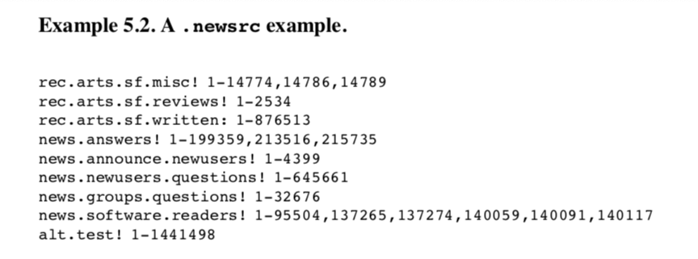
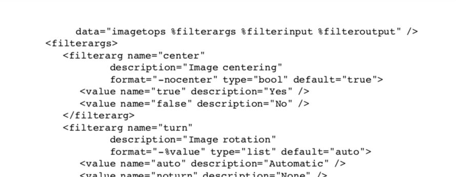
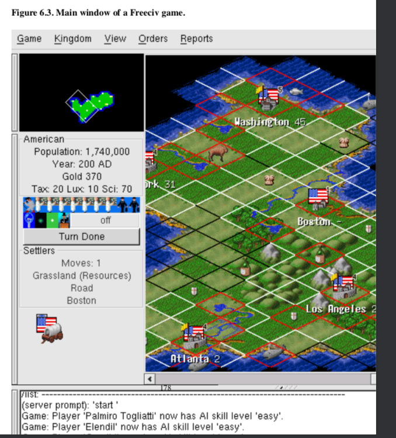
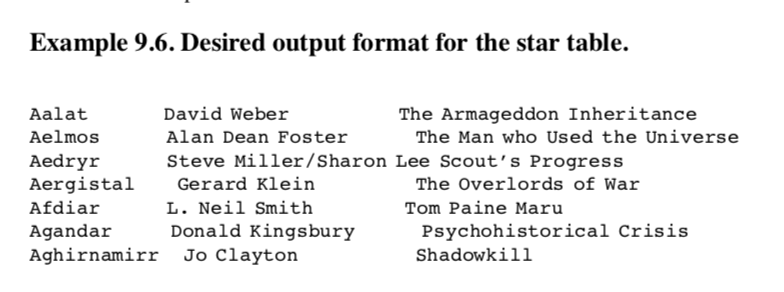
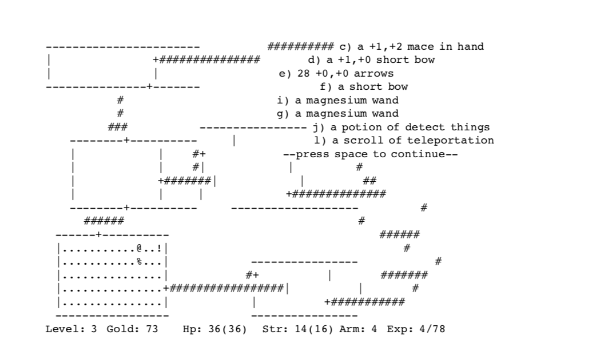

# Part Two: Design
## Chapter 4: Modularity
* _There are two ways of constructing a software design.  One is to make it so simple that there are obviously no deficiencies; the other is to make it so complicated there are no obvious deficiencies.  The first method is far more difficult._  - C. A. R. Hoare
* Code partitioning methods have evolved over time
	* One big “pile” of machine code
	* Partition by subroutine
	* service libraries to share common utility functions across multiple programs
	* separated address spaces and communicating processes
	* disturbing program systems across multiple hosts operated geographically
* We want simple modules connected by well-defined interfaces
	* _note:_ this is why we want to keep internals of classes private whenever possible, and to expose the smallest API we can
	* Exposed functions that are called by other classes/programs can't be refactored out in the future as easily
* History; in  the languages commonly used in 1970, function calls were expensive;  this actually made programming modularly expensive in machine time. This story:
	* _Dennis Ritchie encouraged modularity by telling all and sundry that function calls were really, really cheap in C.  Everybody started writing small functions and modularizing.  Years later we found out that function calls were still expensive on the PDP-11, and VAX code was often spending 50% of it’s time in the CALLS instruction.   Dennis had lied to us!  But it was too late; we were all hooked…_

### Encapsulation and Optimal Module Size
* _Encapsulation_:
	* Modules don’t expose their internals to each other,
	* they don’t call into the middle of others implementations
	* they don’t promiscuously share global data
* _APIs (Application Programming Interfaces):_ narrow, well-defined sets of procedure calls and data structures
	* Serve as choke pints between modules, preventing their internals leaking
	* APIs define your architecture
* Software systems should be hierarchies of nested modules, with the grain size of the modules at each level held to a minimum
* Very small and very large modules are associated with the most bugs
	* Statistically correlated, this holds across system implementations on languages

### Compactness and Orthogonality
* _Compactness:_ the property that a design can fit inside a human being’s head
	* _Semi-compact_ designs have a compact set of commands that will suffice for 80%+ of use cases, with allowance for exceptions
	* The number of discrete items of information human beings can hold in short-term memory is seven, plus or minus two (_Miller_)
		* Do we need to remember more than seven entry points to an API?
	* Note that still, some problem domains are too complex for a compact design to span them. - we might need to trade off compactness for raw power, range, or something else
* _Orthogonality_: operations do not have side effects; each action changes just one thing without affecting others.  There is one and only one way to change each property of the system
	* “Do one thing well”
		* Both simplicity and orthogonality
* _Refactoring_: change code’s structure and organization without changing its observable behavior
	* See ‘Extreme Programming’

### The SPOT Rule
* Single Point of Truth
* “Don’t Repeat Yourself“
* Repetition leads to inconsistency and broken code, imagine changing some repetitions instead of all of them
* Complexity is a cost
* Constants, tables, metadata should be declared and initialized once and imported elsewhere
* Duplicate code is a code smell
* Caches should only be used if absolutely necessary, because stale caches and synchronization code is often a source of bugs

### Software is a Many-Layer Thing
* _Bottom-up_: concrete to abstract
	* Unix programmers prefer this
	* You throw away less code
*  _Top-Down_: abstract to concrete - from highest level specification describing the project as a whole, application logic, down to individual operations
	* Often thought to be correct, especially when:
		1. You can specify in advance precisely what the program is to do
		2. The specification is unlikely to change significantly during implementation
		3. You have a lot of freedom in choosing, at a low level, how the program is to get that job done
* Is the design organized around its main event loop (top down), or. service library of all the operations the main loop can invoke (bottom up)?

### Glue Layers
* Real code tends to be made both bottom-up and top-down; we they collide, we get a mess
* Glue-layers matches our data together
	* this logic should e as thin as possible, otherwise we get lots of bugs

### Coding for Modularity
* How many global variables does it have?  Global variables let components leak information to each other carelessly
	* Globals also mean your code cannot be reentrant; multiple instances in the same process are likely to step on each other
* How large are your modules?
* Are individual functions in your modules too large?
	* Think about this in terms of internal complexity rather than line count
	* Concern yourself with many levels of indentation
* Does your code have internal APIs?  These APIs should make sense and be understandable without looking at the implementation behind it.

## Chapter 5: Textuality

### Good Protocols Make Good Practice
* We want two ways of formatting data:
	* File formats for retaining application data in permanent storage
	* Application protocols for passing data and commands between cooperating programs
* _Marshaling:_ **Save** operation that serializes data structures into a byte stream representation from which the structure can later be recovered (think linked lists)
	* _Unmarshaling:_ **Load** operation that recovers these data structures
* Important themes in designing file formats and application protocols:
	* Interoperability
	* Transparency
	* Extensibility
	* Store Economy
	* Transaction Economy

### The Importance of being Textual
* Text streams are a valuable universal format because they’re easy for human beings to read, write, and edit without specialized tools
* When you feel the urge to design a complex binary file format, or a complex binary application protocol, it is generally wise to lie down until the feeling passes
* Textual formats serve to future proof your system (vs binary formats)
* Example `.newsrc` file
* 
  * Each line sets properties for a news grew named by the first field
  - Then a `:` indicates subscription, `!` indicates non subscription
  - We have article numbers and ranges to indicate which articles have been seen
  - A binary format might be faster but this would not be human readable
* Example `XML`
	* Angle bracketed tags andampersand-led literal sequences
	* simple plain-text markup
	* Expresses recursively nested data structures
	* Low-level syntax, requires document the definition
	* 

### Unix Textual File Format Conventions
* One Record per newline-terminated line, if possible
	* Makes it easy to extract and integrate through records with text-stream tools
* Less than 80 characters per line, if possible
	* Ordinary terminal windows can browse the file
* `#` as an introducer for comments
* Support backslash-escape characters
* In one-record per line formats, use any clan or any run of whitespace as a field separator
* All whitespace should be equal or how would you read it
* Favor Hex over Octal
* For complex records, use a stanza format: multiple lines per record, with a record separator line of `%%\n` or `%/n`
* Either include a version number or design the format as self-describing chunks independent of each other
	* what if you need to change or extend the format?
	* We want to add new chunk types without changing the code
* Beware of floating-point road off problems
* Don’t bother compressing or binary-encoding just part of the file

### HTTP As a Universal Protocol
* Application protocol designers have layered special-purpose protocols on top of HTTP
* This makes sense because at the transaction layer HTTP is very simple and general
* _URIs  & URLs_: —Universal Resource Indicator and Uniform Resource Locator.  URLs are a subset of URIs

# Chapter 6: Transparency

### Let there be light
* _Transparency_: Software systems are transparent when they don’t have murky corners or hidden paths
	* a program is transparent when it is possible to form a simple mental model of its behavior that is actually predictive for all or most cases
	* transparency is about “reducing the cost of living” of the code
* _Discoverability_: Software systems are discoverable when they include features that are designed to help you build in your mind a correct mental model of what they do and how they work
	* Good documentation helps
	* Good choice of variable and function names help
	* Discoverability is about reducing “barriers to entry“
* These properties are good
	* Users can use UIs because of a lower learning curve
	* “Rule of Least Surprise”
* Examples
	* Linux kernel source is very transparent but not discoverable - acquiring the minimum knowledge needed to live in the code and understand the idiom of the devs is difficult, but once you do the whole makes sense
	* Emacs lisp libraries are discoverable but not transparent -> it’s easy to acquire enough knowledge to tweak just one thing, but quite difficult to comprehend the whole system.
* README files are good

### Case Study: kmail
* _kmail_ is a GUI mailreader
* _kmail_ has small notifications in a subwindow
	* its easy to ignore these notifications but easy t focus on them when you need to
* Good interface design; informative but not distracting
* Don’t just dumb down your UI,  leave the details accessible but unobtrusive

### Case Study: Freeciv Data Files
* _Freeciv_ is an open source Civilization-2 like game
* 
* Has client-server partitioning
	* server maintains shared state and client presents the GUI
* Fixed data of the game is read from a property registry at server startup time, rather than being fixed by server code
	* These registry files have internal lists of data (nations, unit types, etc)
	* There is an `include` / `require` directive so we can have hierarchies of registry files, like unit types etc
	* These are all human editable files
	* One can create a new nation just by editing text in files, without changing the server code
* Some design conflict from this:
	* The server ignores proper names it doesn’t know how to use
	* _Rule of Repair_: if we misspell something in our registry file, things break and it is not obvious why
	* _Rule of Separation_: this means that the development of the game data (policy) and server (mechanism) is very seperated
	* A unix solution to this would be a separate auditing program that prepares a report from this
* Note that no program writes to these registries, because that would lead to creep & corruption problems
	* Just look at Windows lol

### Designing for Transparency and Discoverability
* If you want transparent code, do not layer too much abstraction over what you are actually manipulating
* OO (object-oriented) design tends to over complicate these abstractions and make the code less transparent
	* this makes opaque and difficult to debug
* Code properties to think about:
	* What is the maximum static depth of your procedure-call hierarchy?
	* Does the code have invariant properties that are both strong and visible?
		* 	Invariant is a property that is preserved by every operation - e.g., databases need primary keys, C strings must have NUL byte, inventory systems can’t have counts of less than zero, etc
		*These help humans read code and detect problem cases
	* Are function calls in your APIs individual orthogonal, or do they have too many magic flags and mode flags that have a single call going multiple tasks?
	* Are there a handful of prominent data structures that capture the high-level state of the system?  Is this state easy to visualize and inspect?
	* Is there a one to one mapping between data structures & classes in your program and the entities in the world they represent?
	* Is it easy to find the code responsible for any given function?
	* Does code have special cases or avoid them?
	* Any magic numbers? (Unexplained constants)
* _Rule of Robustness:_ Simplicity plus transparency lowers costs
* Software is maintainable when developers who are not the author can successfully understand and modify it
* Any open source code that does not have transparency and discoverability may become dormant

## Chapter 7:  Multiprogramming
* We can program-modularize by splitting large programs into multiple cooperating processes
	* This is called _multiprocessing_ or _multiprogramming_

### Pipes, Redirection, and Filters
* _pipe_: construct that every program have standard input and standard output, so we can chain them together
* _filters_:  programs that read sequentially from standard input and write only to standard output
* Some Linux/batch commands
	* `ls >foo.txt`
		* sends output of `ls` to `foo.txt`, giving us a file of the current directory listing
	* `wc <foo.txt`
		* sends `foo.txt` as input to `wc`, getting us the word count of that file
	*   `ls | wc`
		* We run `ls` and send output to `wc`, resulting in the word count of the current directory listing
		* Connecting programs with pipe this way gives us a _pipeline_
* Pipes are unidirectional
* Child programs may need to both accept data from and return data to their callers through pipes connected to standard input and output, interactively
	* both master and sale processes need to have internal state machines to handle a protocol between them without deadlocking or racing
* In a master/slave pair, the master should support a command-line switch variable that allows callers to set their own sale command, which helps with debugging
* Consider (not related to m/s) we have SQL implementations, which are used by a lot of applications, but we do not want our software to deal with the internals of managing the database, just talking to middleware

## Chapter 8: Minilangauges
* Programmer error rates in defects per hundreds of lines are largely independent of the language in which the programmers are coding
	* it follows that we get fewer bugs in higher level languages that allow getting more done in fewer lines\
* Domain specific languages such as _make_, typesetting languages, shell utilities, etc, are called _minilanguages_
	* Since we want to use these in very specific contexts, we want our designs to be small and simple.
* Minilanguages are good because we can write in very expressive languages and have our lower level code deal with implementation
	* Think of rails generators and rails to html code
* Minilangauges can evolve out of specification files
* Ad-hoc building these languages is bad

### Case Study: Regex
* _Regex_, _regexp_, _Regular Expressions_
* This is a declarative minilanguage for describing text patterns, and other languages can use it
* Also describe patterns hat match or fail against strings

### Case Study: Javascript
* Note that some languages are Turing complete or not, JS is
* At time of this book (before Node.js), Javascript is not a general-purpose language, and it has many restrictions to prevent attacks not eh browser.
	* JS is interesting for being as close to a general purpose languages as one can get without actually being there
	* Binding between client-side JS and it’s browser environment via a single DOM object is a good design which may be generalizable

### Designing Minilanguages
* Minilangauges offer a way to push problem specifications to a higher level
* We must choose complexity, so we want to be as simple as possible
	* We prefer a structured data file than minilangauge if possible
* Minilanguages that are only accidentally Turing-complete may be very dangerous
* Easiest way to write minilangauges is to code service functions in an interpreted language, like plug ins in Emacs, etc
* For declarative languages, using XML might be the way to go unless you have a specific reason not to

## Chapter 9: Generation
### Pushing the specification level upwards
* Human beings are better at visualizing data than they are at reasoning about control flow
* Data is more tractable than program logic, data here being a table, some markup language, some template, etc
* Complexity of design should be in data, not code
* Unix likes Data-driven programming
	* Data driven programming has data defining the control flow of the program
	* Object Oriented programming uses data to store the state of some object
* When doing code generation or data driven programming, **always push problems upstream**
	* Don’t hack generated code and don’t change your intermediate representations
	* improve translation tool or your initial data instead

### Example: HTML Tables

* Consider wanting this information into an HTML table
* Think about hand writing all the <tr> and <td>, but obviously this is bad because if anything changes it becomes hard to maintain, we want to have some language to generate all the HTML from the output.

* In conclusion:
	* Do as little work as possible
	* Let the data shape the code
	* lean on tools
	* separate mechanism from policy

## Chapter 10: Configuration
### What should be Configurable
* Everything :P
	* Actually, if it’s too much things are overwhelming
	* So what should _not_ be configurable?
* Don’t provide configuration switches for what you can reliable detect automatically
* Questions to ask before adding a configuration option:
	* Can I leave this feature out?
	* Could the program’s normal behavior be changed in an innocuous way that would make the option unnecessary?
	* Is this option cosmetic?
	* Should the behavior enabled by this option be a separate program instead?
* Many options will hurt test coverage (see how it can easily double many tests)

* Generally we want more local settings to override more global ones
	* Preferences that will change between invocations should be command line switches, preferences which will change seldom  should be in run-control files

### Chapter 11: Interfaces
* The interface of a program is the sum of all the ways that it communicates with human uses and other programms
* The Rule of Least Surprise: _Do the least surprising thing_
	* Tradeoff between mechanical conservatism - which makes the interface less useful - and interface novelty - which makes the interface less accessible
* Whenever possible, allow the user to delegate interface functions to a familiar program
* Evaluating interface designs
	* Concision
		* How little you need to do to accomplish something
	* Expressiveness
		* The space of things the program can do
	* Ease
		* What does the user specifically need to remember to use this interface
	* Transparency
		* How little do you need to remember while using the interface, how much data does the interface give you (see transparency chapter)
	* Scriptability
* To compare concision vs expressiveness, consider a keyboard vs hitting keyboard buttons on a screen
* CLI vs GUI:
	* GUIs generally easy
	* Database queries w/ a GUI can easily be terrible
	* Photoshop is an example of a program that is inherently visual
* Filter Pattern:
	* Takes data on standard input
	* transforms it
	* sends it to standard output
	* not interactive
* Cantrip Pattern:
	* No input, no output, just invocation and numeric exit status
	* Program can call cantrips to accomplish tasks
	* Named after Scottish wizards of course
* Source Pattern:
	* filter-like program that requires no input
	* output is controlled by startup conditions
	* consider `ls`
* Sink Pattern:
	* A filter-like program that consumes standard input but emits nothing to standard output
	* Like the source pattern, actions are only controlled by startup conditions
	* more unusual
* Compiler Pattern
	* It’s a compiler
* Rougelike pattern:
	* Consider _Nethack_
	* 
	* Commands are single keystrokes that do something
	* Sometimes this is opening a submenu - we get arrow keys, etc
	* Lots of commands from _vi_ and _emacs_
	* Vim is a roguelike lol
* 	We can design better programs by separating the interface and the engine into different programs
* Model-View-Controller pattern for GUIs
	* _Model_, or Engine: Domain specific data structures and logic for the application
	* _View_: renders domain objects into visible form
		* Well separated MVC applications allow the view to react to the model on it’s own, but this isn’t quite true for say,, a web server, when request for model updates go through the control itself
	* _Controller_: Prowesses user requests and passes them as commands to the model
* Configurator / Actor Pair
	* interface part controls startup environment of filter or daemon-like program that runs w/o further commands
* Spooler / Daemon Pair
	* Useful in situations with access to some shared resource; a well defined job stream or sequence of requests requires this resource, but none of these jobs require user interaction
	* The front end / cooler drops job requests as files to a directory, or spool area.  
	* The daemon runs in the background, polls the spool directory, and does any work that has been requested, then deletes the jobs
	* Composed of
		* A job launcher
		* a queue listener
		* job cancellation utility
		* spooler daemon
* Driver/Engine Pair
	* Interface supplies commands to and receives output from an engine after startup
	* These programs tend to be more highly coupled
* Client/Server Pair
	* The server is an engine / daemon running in the background which does not have a user interface.
	* A client interacts with this service and gives it commands
* CLI server pattern
* Web browser as a universal front end
	* Lol wait this actually just happened
	* This is helpful because GUIs and user interaction is shared across many websites
	* This is bad because
		* the web enforces a batch style of interaction
		* managing persistent sessions using a stateless protocol is non trivial
* The Rule of Silence
	* Programs with nothing interesting or surprising to say should shut up
	* If you don’t follow this, you program doesn’t play well with other programs
	* Programs that emit bad output will need to have that output parsed by humans

## Chapter 12: Optimization
* The most important optimization technique is to do nothing
* Because of Moore’s law, we can just wait for a few months and buy better hardware (computer parts are cheaper than programmers)
* We use O(n) and O(n^2) because reducing resources use by a constant factor rarely matters
	* Moore’s law eats linear performance gains
* Measure before optimizing
* Heisenbergs uncertain principle as applied to code profilers: code that measures the time your code takes itself takes time, so it adds in noise
	* the instrumentation / noise problem
* Throughput vs Latency
	* Especially with internet programs, fast processors make it such that performance is bounded by cost of I/O and network transactions
	* Avoiding protocol round trips - see N+1 errors when accessing databases
	* Consider choosing between doing an expensive computation once beforehand assuming we will do it multiple times, or computing only when needed, which will result in recomputing the results
		* choose low latency, and don’t precompute.  Processor cycles are cheap
		* gives us shorter startup time and response
	* Reduce latency by
		* batching transactions that share startup costs
		* allow transactions to overlap
		* cache things

## Chapter 13: Complexity
* As simple as possible, but no simpler
* How do you tell when something is as simple as possible?
* Three sources of complexity
	* Implementation Complexity
	* Interface Complexity
	* Codebase size
* Premature optimization tends to increase codebase size
* _Manularity trap_: Dumping low level tasks on the user to avoid complexity is quite bad
	* A code editor without a global-replace feature
